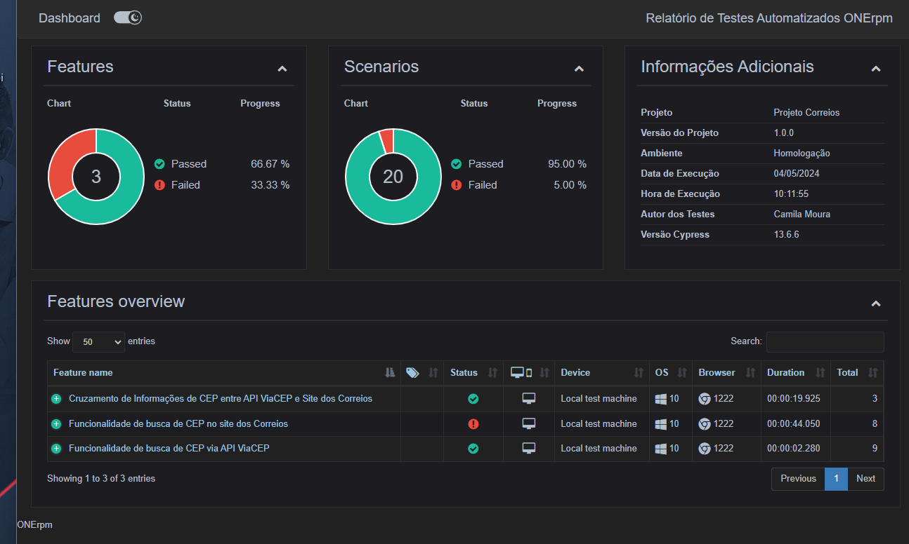

# Automação de Busca de CEP

Projeto de exemplo com funções de automação de testes para a busca de CEP, que:

- Aceita entradas de CEPs válidos e inválidos tanto no site dos [Correios](../testes-automatizados-correios/cypress/scenarios/frontend/cepSearch.feature) quanto via API do [ViaCEP](../testes-automatizados-correios/cypress/scenarios/backend/cepAPI.feature).
- E retorna verdadeiro se os dados do endereço correspondem ao CEP informado e falso caso contrário.

> **Nota:** Este projeto automatiza a funcionalidade de busca de CEP, onde o usuário pode inserir um CEP e, em resposta, visualizar os dados do endereço correspondente.

## Pré-requisitos

É necessário ter o Node.js e o npm instalados para executar este projeto.

> Usei as versões `v14.17.3` e `6.14.13` do Node.js e npm, respectivamente. Sugiro que você use essas versões ou posteriores.

## Instalação

Execute `npm install` (ou `npm i` para a versão curta) para instalar as dependências de desenvolvimento.


## Testes

Execute `npx cypress run` para executar os testes automatizados.

> Após executar os testes, você deverá ver um resultado como este:

```sh
> cypress run

  Busca de CEP no Frontend
  Funcionalidade de busca de CEP no site dos Correios
    ✔ Buscar por CEPs válidos e verificar informações detalhadas (example #1)passed
    ✔ Buscar por CEPs válidos e verificar informações detalhadas (example #2)passed
    ✔ Buscar por CEPs válidos e verificar informações detalhadas (example #3)passed
    ✔ Buscar por um CEP inexistentepassed
    ✔ Buscar por um CEP com formato inválido
    √ Buscar por CEP usando endereço completo (example #1) (4792ms)
    √ Buscar por CEP usando endereço completo (example #2) (5749ms)
    √ Buscar por CEP usando endereço completo (example #3) (3002ms)

  Busca de CEP no Backend
  Funcionalidade de busca de CEP via API ViaCEP
    ✔ Busca por CEPs válidos e existentes (example #1)passed
    ✔ Busca por CEPs válidos e existentes (example #2)passed
    ✔ Busca por CEPs válidos e existentes (example #3)passed
    ✔ Consultar CEP com formato inválido
    ✔ Consultar CEP inexistente e verificar mensagem de erro
    ✔ Alternar entre consulta de CEP válido e inválido
    ✔ Busca por CEPs válidos e verificar detalhes específicos

  Busca de CEP no Frontend e no Backend
  Cruzamento de Informações de CEP entre API ViaCEP e Site dos Correios
    √ Validar consistência das informações de CEP entre API e Site dos Correios (example #1) (10449ms)
    √ Validar consistência das informações de CEP entre API e Site dos Correios (example #2) (4959ms)
    √ Validar consistência das informações de CEP entre API e Site dos Correios (example #3) (4313ms)


    Spec                                              Tests  Passing  Failing  Pending  Skipped
  ┌────────────────────────────────────────────────────────────────────────────────────────────────┐
  │ ✔  backend/cepAPI.feature                   00:02        9        9        -        -        - │
  ├────────────────────────────────────────────────────────────────────────────────────────────────┤
  │ ✖  frontend/cepSearch.feature               00:47        8        7        1        -        - │
  ├────────────────────────────────────────────────────────────────────────────────────────────────┤
  │ ✔  integration/two-tierValidation.feat      00:23        3        3        -        -        - │
  │    ure                                                                                         │
  └────────────────────────────────────────────────────────────────────────────────────────────────┘
    ✖  1 of 3 failed (33%)                      01:12       20       19        1        -        -

```

## Relatório de Testes

Para gerar o relatório de testes usando a biblioteca Multiple Cucumber Html Reporter, siga estas etapas:

1. Após a execução dos testes automatizados, execute o seguinte comando para gerar o relatório:
   
   ```sh
   node cypress/cucumberReport.js
   ```

> Após receber a mensagem de confirmação no terminal, navegue até a pasta cucumber-report. Em seguida, localize o arquivo [index.html](../testes-automatizados-correios/cypress/cucumber-report/index.html), clique nele com o botão direito do mouse e escolha a opção Reveal in File Explorer para visualizá-lo no explorador de arquivos.





___

This project was created with 🐶 by [Camila](https://www.linkedin.com/in/camilalnmoura/).
